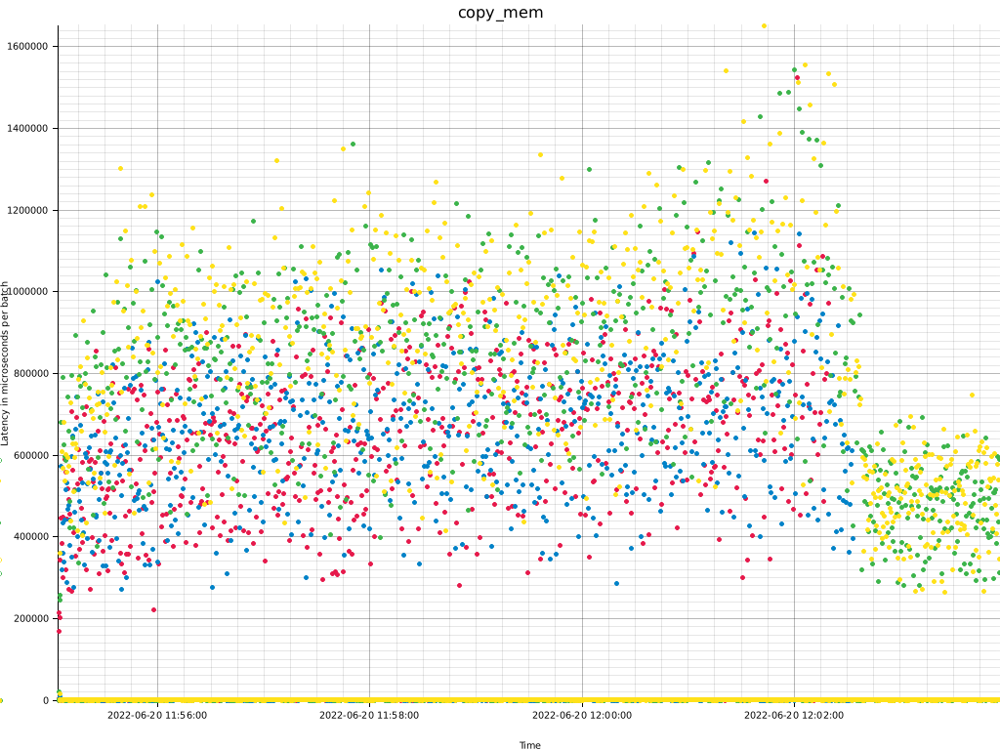

# ysql-bench
This is a benchmark engine to perform IO patterns against Yugabyte YSQL.

At current, it can perform the following scenario's:
- perform loading dummy data using INSERT (insert operation).
- perform loading dummy data using COPY FROM using rows in memory (copy-mem operation).
- perform loading dummy data using COPY FROM using a CSV file (copy-file operation).
- perform loading dummy data using a procedure (procedure operation).
- perform select statements that select all rows via a primary key lookup (select operation).
- perform update statements that update all non PK fields via a primary key lookup.

For all scenario's:
- the number of concurrent connections can be specified (threads).
- a statement can be used as prepared statement not as regular statement (set no-prepared to not use prepared statements).
- a histogram can be printed on the CLI about the latency distribution of the executions (set print-histogram).
- a scatterplot can be created as PNG file to see the latency distribution (set graph).
- the size of a row in YSQL can be printed (set show-rowsize).

All scenario's currently use a table named `test_table` in the default database of the user used.
```
yugabyte=# \d test_table
             Table "public.test_table"
 Column |  Type   | Collation | Nullable | Default
--------+---------+-----------+----------+---------
 id     | integer |           | not null |
 f1     | text    |           |          |
 f2     | text    |           |          |
 f3     | text    |           |          |
 f4     | text    |           |          |
Indexes:
    "test_table_pkey" PRIMARY KEY, lsm (id HASH)
```
This is a typical YugabyteDB table with a primary key based on an hash index.
The f1..f4 fields are text fields for the purpose of being able to make them any size, and thus can size the row to any size.

## load scenario's
For the load scenario's, the following switches can be used:
- fields-length: the length of each text field: default 24 characters.
- rows: the number of rows to load/generate.
- nontransactional: set `yb_disable_transactional_writes` to on.
- tablets: set the number of tablets for table creation.
- drop: drop the current table so the table is recreated with the set number of tablets. A table is only recreated if it doesn't exist.

### load scenario's insert, copy-mem, procedure
For the scenario's of insert, copy_mem and procedure, the batch_size is set. 
- For insert, it means a "multi values insert" is generated with the number of rows added to a single insert statement (`insert into test_table (id, f1, f2, f3, f4) values (1, 'a', 'b', 'c', 'd'), (2, 'a', 'b', 'c', 'd')`) that is set as batch_size, and a commit.
- For copy-mem, it means a `copy test_table from stdin` command with the number of rows written to STDIN as set in batch_size and a commit.
- For procedure, it means the number of rows that are created as plpgsql array for an insert statement with the attributes as arrays via the unnest() function as set with batch_size and a commit.

### load scenario copy-file
The scenario of copy_file is a special case. copy_file performs `copy test_table from '/tmp/ysql_bench-t{}-r{}-f{}--nr{}.csv`, and requires that file to be there on the local server in /tmp.
This file can be generated with the additional utility `csv_generator`.
This requires careful setting of threads, rows and field length!
The ysql_bench*csv file is generated using the settings of threads, rows and field length settings, for which the settings are included in the csv file name.
The settings of threads, rows and field length are required to be identical when executing the the copy_file scenario, which uses these settings to create the filename to read it.

This is how to create the CSV files using `csv_generator`:
```
$ csv_generator --rows 10000000 --threads 4 --fields-length 24
```
The files will be created in the current working directory, and need to manually distributed to all the nodes that will execute the load.

By default, the yugabyte user is not granted the `pg_read_server_files` role, which can by granted by the yugabyte user to itself:
```
grant pg_read_server_files to yugabyte;
```

## select and update scenario's
For the select and update scenario's, we rely on the `test_table` to be present, which can be loaded using the above load scenario's.
Because we don't have a fixed amoun of work like in a load scenario, the time the select or update scenario's are executed is set in minutes using: `runtime_select`
Also, the `rows` switch must be set to the actual number of rows created. The following query is executed:

For the select scenario:
```
select f1, f2, f3, f4 from test_table where id = $1
```

For the update scenario:
```
update test_table set f1=$2, f2=$3, f3=$4, f4=$5 where id = $1
```

Where `$1` is a random number between 0 and `rows`.
For the update scenario, $2, $3, $4 and $5 are filled with random characters, for the length set with `fields_length`. The fields_length flag can be set to a higher or lower number than the table was created with.

## results
For a benchmark tool, it's important that the work (queries) performed and how they are executed are very well known, otherwise it's impossible to assess the outcome of the work, which is the work is described above carefully.
As important as the work being performed is the reporting on the work performed; without accurate timings it's impossible to get an understanding of the client side.

This is how the default output of a load looks like:
```
$ ysql-bench --drop -r 10000000 -u "host=localhost port=5434 sslmode=disable user=yugabyte password=yugabyte" -o copy_file -t 4 --tablets 18
>> creating nossl pool
>> drop table
>> create table if not exists
>> truncate table
>> copy_file
wallclock time  :   121.823632 sec
tot db time     :   451.350596 sec 370.50 %
rows per thread :      2500000
threads         :            4
batch           : -
total rows      :     10000000
nontransactional:        false
wallclock tm/row:    12.182363 us
db tm/row       :    45.135060 us
```
- wallclock time: the total time the run took as measured by using the system clock.
- tot db time: the total time of each thread running in the database. The percentage shows together with the number of threads can be used to determine if time is spent by ysql-bench itself, not in the database: with 4 threads, if all time is spent in the database, the percentage should be 400%.
- rows per thread: the number of rows in total that are processed by each thread.
- threads: the total number of threads/database connections.
- batch: the number of rows per batch, with copy_file, the batch number is not used, hence '-'.
- total rows: the total number of rows processed by the run.
- nontransactional: whether the nontransactional switch is set (`yb_disable_transactional_writes`).
- wallclock tm/row: average wallclock time per row in microseconds: wallclock time / total rows.
- db tm/row: average database time per row in microseconds: tot db time / total rows.

### histograms
The downside to the latency figures (wallclock tm/row and db time/row) is that these report averages over the total.
In a lot of cases there can be different latencies based different codepaths that a row can take, or temporal increased latencies due to waiting on concurrency mechanisms or resources. 
For such cases, a histogram of the latencies can be extremely helpful or even mandatory to get an understanding of the latencies which is impossible by looking at averages and/or at limited latency figures such as minimum and maximum figures and a few percentiles.
Histograms can be enabled using the `print-histogram` switch, and looks like this:
```
wallclock time  :   530.851536 sec
tot db time     :  1899.283324 sec 357.78 %
rows per thread :     10000000
threads         :            4
batch           :          200
total rows      :     40000000
nontransactional:        false
wallclock tm/row:    13.271288 us
db tm/row       :    47.482083 us
histogram is per batch (200 rows)
# Number of samples = 200000
# Min = 2
# Max = 1432214
#
# Mean = 9496.416620000096
# Standard deviation = 85008.27916735923
# Variance = 7226407526.995681
#
# Each ∎ is a count of 3946
#
      2 ..  143223 [ 197312 ]: ∎∎∎∎∎∎∎∎∎∎∎∎∎∎∎∎∎∎∎∎∎∎∎∎∎∎∎∎∎∎∎∎∎∎∎∎∎∎∎∎∎∎∎∎∎∎∎∎∎∎
 143223 ..  286444 [     27 ]:
 286444 ..  429665 [    228 ]:
 429665 ..  572886 [    557 ]:
 572886 ..  716107 [    600 ]:
 716107 ..  859328 [    652 ]:
 859328 .. 1002549 [    370 ]:
1002549 .. 1145770 [    184 ]:
1145770 .. 1288991 [     58 ]:
1288991 .. 1432212 [     12 ]:
```
A very import line is: histogram is per batch (200 rows). Each actual database execution deals with a batch, so the actual measurements for the histogram are for such a batch.
That mean that you need to calculate the per row figures in the default (upper) overview to the per 200 rows figures for the histogram.
If you take the mean figure (9496.42) and divide it by 200 (rows per batch) you get 47.48, which is the db tm/row.

The most important thing to see, is that the vast majority of executions took between 2 and 143223 microseconds, and a small percentage (approximately 1.2%) took a higher latency.

### scatterplots
But what if you want to get a better and deeper understanding of the latencies, beyond what is visible in with the histograms?
That is possible using scatterplots. By taking the latency measurements and graphing the latencies (on the Y axis) over time (on the X axis) it becomes possible to understand trends in latencies, or time based latency deviations.

  
This scatterplot shows 4 thread latencies, shown by the colours of the dots (green, yellow, red and blue). 
The vast majority is has low latency and are all drawn on the bottom of the graph, which cannot be seen from the graph, because they are overwritten, and shows essentially a yellow line.  
The dots show the latency outliers. This scattergraph shows a trend in the outliers that indicates a gradual increase, until the red and blue threads stop, after which the outliers significantly get lower. 

### histogram and scatterplot caveat
For the load and query types where the SQL executes a single statement, the histogram and scatterplot will not show anything useful, because for the loading via the procedure, as well as the copy from file will execute a single command.

# load balancing over YSQL nodes
Rust does currently not have a native YugabyteDB adapter, and therefore relies on the postgres adapter for YSQL connections.  
Because the postgres adapter does not have a native mechanism to distribute connections over multiple nodes, which is what YugabyteDB YSQL can greatly benefit from, at current the simplest way to still achieve using multiple YSQL instances in the cluster is to use haproxy.